<!--
  Animated profile art is generated locally and committed to this repository.
  Portrait: python scripts/prep_photo.py && python scripts/make_ascii_svg.py
  Wordmark: python scripts/make_wordmark_svg.py --mode rock --out wordmark.svg
  Contributions: refreshed daily by .github/workflows/update-profile-art.yml
-->

<h3><code>farhan@github ~ $ whoami</code></h3>

<table>
<tr>
<td valign="top"></td>
<td valign="top"></td>
</tr>
</table>

 
 

<h3><code>farhan@github ~ $ ./contributions.sh</code></h3>

 
 

<h3><code>farhan@github ~ $ ./about.sh</code></h3>

<b>MERN &amp; AI Developer · Full-Stack Product Engineer</b>

Building AI-powered products, automations, voice agents, and responsive full-stack experiences for real-world workflows.

<code>MongoDB · Express · React · Next.js · Node.js · NestJS · TypeScript · AI Integrations</code>

